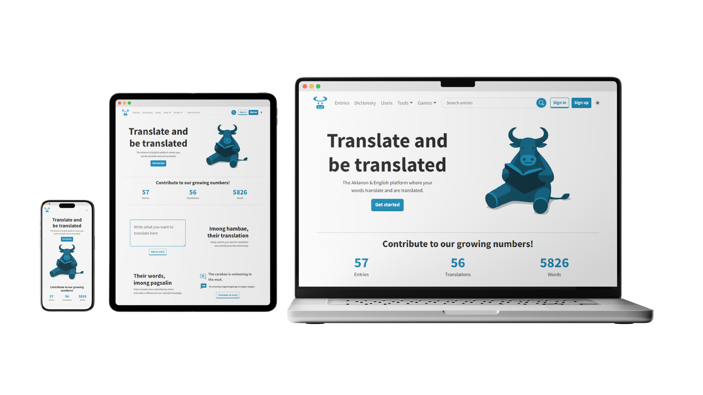

<div align="center">

# Aklish

**A web app for crowdsourcing Aklanon-English translations**



</div>

## About

Aklish is a web app that crowdsources
<a href="https://www.ethnologue.com/language/akl" target="_blank">Aklanon</a>-English
translations. The platform lets users contribute translations with quality
control (dictionaries and spellcheckers) and engagement (leaderboards and word
games) strategies.

### Features

- Bidirectional input of translations
- Browse and search
- Voting system
- Aklanon-English dictionary
- Aklanon and English proofreader (spellchecker)
- Points (reputation) system
- Leaderboard system
- Games
  - Wordle
  - Synonym-antonym match
- Authentication

### Technologies

- **Front-End**: JS ES14, React 18, HTML 5, CSS 4, SASS 1, Bootstrap 5
- **Back-End**: Python 3, Django 5
- **Database**: MySQL
- **APIs**: REST
- **Testing**: PyTest
- **Deployment**: Railway

## Usage

1. **Register an account**: since some features can only be accessed by
   authenticated users, sign up to create a new account or sign in if you
   already have one.
2. **Earn reputation**: some features can only be accessed by earning enough
   reputation points.
3. **Participate**: to earn reputation, submit translations, bookmark, vote, and
   more.
4. **Learn more**: visit the help center for more information.

## Dev Setup

1. Clone the repo
   ```sh
   git clone https://github.com/andrianllmm/aklish.git
   cd aklish
   ```
2. Create and activate a virtual environment
   ```sh
   python -m venv env
   source venv/bin/activate  # or `venv\Scripts\activate` for Windows
   ```
3. Install the dependencies
   ```sh
   pip install -r requirements.txt
   ```
4. Apply migrations
   ```sh
   python manage.py migrate
   ```
5. Seed the database

   Create the superuser account that dictionary examples are attributed to
   (username `admin`, email `admin@example.com`), then load the
   data:

   ```sh
   python manage.py createsuperuser --username admin --email admin@example.com
   python manage.py loaddata translate/fixtures/languages.json
   python manage.py loadattributes
   python manage.py loaddictionary akl
   python manage.py loaddictionary eng
   ```

6. Run the development server
   ```sh
   python manage.py runserver
   ```

### Configuration

Create a `.env` file (see `.env.example`) and configure the following variables:

- `DJANGO_SECRET_KEY`: Django secret key
- `DJANGO_DEBUG`: set to `True` for development or `False` for production
- `DJANGO_ALLOWED_HOSTS`: comma-separated list of allowed hostnames
- `DJANGO_TRUSTED_ORIGINS`: comma-separated list of extra CORS/CSRF origins
- `DATABASE_URL`: database connection URL (falls back to sqlite3 if unset)

## Contributing

Contributions are welcome! To get started:

1. Fork the project
2. Create your feature branch (`git checkout -b feature/AmazingFeature`)
3. Commit your changes (`git commit -m 'Add some AmazingFeature'`)
4. Push to the branch (`git push origin feature/AmazingFeature`)
5. Open a pull request

## Issues

Found a bug or issue? Report it on the
[issues page](https://github.com/andrianllmm/aklish/issues).
